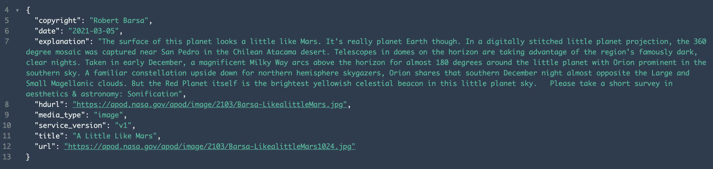

# Mars Explorer

**Live site** – https://mars-explorer.vercel.app/

**This site pulls in the following information:**

1. The current [Sol on Mars](https://en.wikipedia.org/wiki/Sol_(day_on_Mars))
2. The current atmospheric pressure (Pascals) at [Elysium Planitia](https://youtu.be/4zlF0hHuM84)
3. The wind direction and speed at Elysium Planitia

**Added extras:**

1. Modal with [video](https://youtu.be/Flbhk1KHHJw) taken from the Rover on the surface of Mars at Elysium Planitia
2. The site is fully responsive

### Description
The site is pulling in data from two [API's from Nasa](https://api.nasa.gov/), APOD and Insight.

One of the most popular websites at NASA is the [Astronomy Picture of the Day](https://apod.nasa.gov/apod/astropix.html). In fact, this website is one of the most popular websites across all federal agencies.

[NASA’s InSight Mars lander](https://mars.nasa.gov/insight/weather/) takes continuous weather measurements (temperature, wind, pressure) on the surface of Mars at [Elysium Planitia](https://youtu.be/4zlF0hHuM84), a flat, smooth plain near Mars’ equator.

### The APOD API
**Example image**

**HTTP Request**
`GET https://api.nasa.gov/planetary/apod`

**Example query**
`https://api.nasa.gov/planetary/apod?api_key=DEMO_KEY`

### The Insight API
**Example image**

**HTTP Request**
`GET https: //api.nasa.gov/insight_weather/?api_key=DEMO_KEY&feedtype=json&ver=1.0`

**Example query**
`https://api.nasa.gov/insight_weather/?api_key=DEMO_KEY&feedtype=json&ver=1.0`

